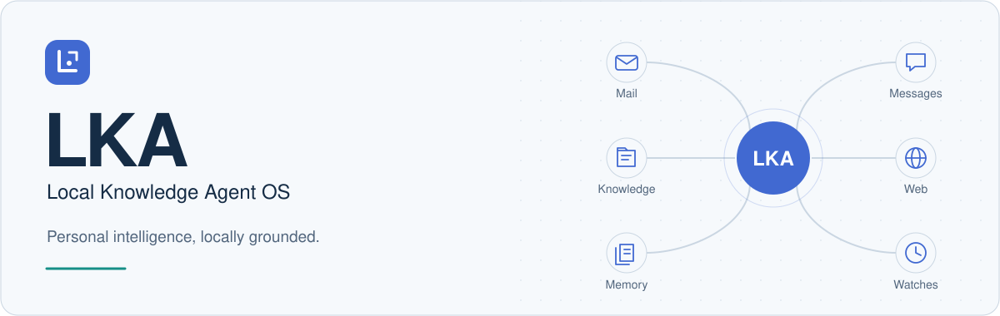

<div align="center">



<h1>查资料、处理任务，记住你交代过的事。</h1>

<p>
一个能查邮件、读消息、整理资料，也能帮你处理项目任务的个人 AI 助手。<br>
保存对话和记忆，需要时继续跟进之前的事。
</p>

<p>
🖥️ 本地优先 &nbsp;&nbsp; · &nbsp;&nbsp; 🪟 Windows / Linux &nbsp;&nbsp; · &nbsp;&nbsp; 🐍 Python 3.12+
</p>

<p>
<a href="#capabilities">功能介绍</a> &nbsp; / &nbsp;
<a href="#everyday">日常场景</a> &nbsp; / &nbsp;
<a href="#engineering">设计思路</a> &nbsp; / &nbsp;
<a href="#evaluation">评测实践</a> &nbsp; / &nbsp;
<a href="#roadmap">未来方向</a> &nbsp; / &nbsp;
<a href="#getting-started">开始使用</a> &nbsp; / &nbsp;
<a href="#documentation">阅读文档</a>
</p>

</div>

---

## 邮件、消息和项目里的事，都可以交给它处理

重要信息往往分散在不同地方：邮件里的约定、群聊里的变化、项目里的文档，
还有你在之前对话里提过的偏好。

**LKA 可以结合这些信息处理任务。** 你说明要做什么，助手查找资料、调用工具，
整理结果。对话和记忆会保存下来，需要持续跟进的事可以设为后台任务。

本仓库提供 LKA 的后端。聊天界面与桌宠由独立的前端项目提供，
这里负责对话、工具执行、知识检索、记忆和持续关注。

<a id="capabilities"></a>

## ✦ 可以用它做什么

<table>
<tr>
<td width="50%" valign="top">

<h3>📬 邮件与消息</h3>
<p>查找邮件和聊天记录，整理需要跟进的事。</p>
<p>搜索邮件、批量阅读、按发件人归类，并关联已有事项。
接入消息历史后，可以检索原始对话、整理话题和重要信息，
查看人物档案及相邻消息。</p>

</td>
<td width="50%" valign="top">

<h3>📚 私人知识库</h3>
<p>从自己的资料里查答案。</p>
<p>连接文档、邮件、消息与工作区，按问题检索相关内容。
关键词搜索、可选的本地语义召回和重排序共同提供上下文，
让你能够继续追问出处、细节与原文。</p>

</td>
</tr>
<tr>
<td width="50%" valign="top">

<h3>🌐 网络研究</h3>
<p>搜索网页，找到相关内容后继续读原文。</p>
<p>搜索网页与新闻，获取关键摘录，再按需打开正文、定位段落、
续读已有快照或刷新内容。保留来源和抓取时间，
方便在后续对话中继续研究。</p>

</td>
<td width="50%" valign="top">

<h3>🛠️ 项目协作</h3>
<p>查项目资料、分析代码，也可以修改文件和运行测试。</p>
<p>在一个项目下开展多个会话，读取资料、分析代码、编辑文件、
执行命令与测试。复杂任务可开启多 Agent 协作，
让子 Agent 并行处理独立子问题，再汇总结果。</p>

</td>
</tr>
<tr>
<td width="50%" valign="top">

<h3>🧠 长期记忆</h3>
<p>记住你提过的偏好和约定。</p>
<p>整理对话中有价值的偏好、约定和事实，分别保存到全局或项目记忆。
记忆可更新、撤回，并保留来源。
后台整理记忆和对话摘要，供后续会话使用。</p>

</td>
<td width="50%" valign="top">

<h3>🧭 持续关注</h3>
<p>按设定的时间检查，整理变化并给出简报。</p>
<p>设定关注目标、信息来源和每日检查时间，跟进新闻、活动、
邮件与本地事项。每次检查投递简报时创建新会话，
你可以直接在这份简报里继续追问。</p>

</td>
</tr>
</table>

<a id="everyday"></a>

## 💬 日常可以这样用

### 看看哪些邮件需要回复

> 这周的邮件里，哪些事情需要我回复？按事项整理，附上对应邮件。

接入邮箱后，助手可以从邮件中查找依据，整理相关往来，
结合已有事项帮助你判断下一步。

### 了解群里最近在聊什么

> 最近这个群在讨论什么？有哪些值得关注的变化？让我能查看原消息。

看完总结后，可以继续查看具体话题、
相关人物、原始消息和上下文。

### 结合项目资料排查问题

> 结合项目文档和代码，解释这个错误的原因。先分析，再给出修改建议。

围绕同一个项目保持多个会话，使用工作区指导、项目记忆和实际文件，
继续调研、排查或修改代码。

### 定时检查关注的事

> 每天看看我关注的活动，有值得关注的变化时整理一份简报，方便我继续追问。

将关注目标保存为定时任务；后端运行期间，按设定时间执行检查，
把本次结果放进新的会话。

## ◇ 数据、模型和操作怎么管理

**数据主要保存在本地。** 会话、知识、记忆与运行记录由本机保存，
默认服务只监听本机地址。

**模型服务可以自己配置。** 连接模型和自己的数据源，按需启用邮件专家、
多 Agent、消息分析与后台任务。

**工具操作按配置审查。** 工具调用会经过安全审查，也可以配置为人工确认。
相关调用、来源和运行过程保留记录，方便回看。

**长内容可以分次读取。** 工具返回的长结果保留在本地，先提供预览，
需要时再读取更多，减少重复获取同一份资料。

<details>
<summary><strong>🔎 关于数据连接</strong></summary>

使用远程模型时，发送给模型的对话、选取的资料片段和后台整理输入，
会交给你配置的模型服务；网页搜索会把查询发送给搜索服务。

完整运行日志可能包含个人内容，请妥善保管。
真实配置、密钥、邮箱授权和运行数据保持本地，仓库只保留无凭据的配置模板。

</details>

<a id="engineering"></a>

## 🧩 后端怎么工作

后端负责把对话、资料和工具组织到一次任务里，也负责保存结果和处理后台作业。
下面是几个主要的设计选择：

| 面对的问题 | 设计选择 | 解决什么问题 |
| :--- | :--- | :--- |
| 工具和资料越来越多，上下文却有限 | 工具按包发现、按需展开；长结果保存原文，先送预览，再按需续读 | 减少无关输入，需要更多内容时仍能读取原文 |
| 复杂任务需要并行，但不能失去控制 | 任务计划表达依赖关系；子 Agent 使用独立上下文、工具范围和预算，失败反馈给父任务修订计划 | 记录分工和交付结果，失败时由父任务调整计划 |
| 助手需要长期整理信息，又不能拖慢对话 | 记忆提取和摘要放到后台；持久作业配合租约、检查点及发布前版本校验 | 减少对话等待，支持中断后继续处理，避免旧任务覆盖新结果 |
| 不同任务、模型和平台需要持续扩展 | 通用 Agent 核心与领域服务分离；工具输入校验、操作审查和运行记录统一处理 | 邮件、网页、文件等功能可以分别修改，Windows / Linux 共用主要运行逻辑 |

这些机制已经有对应实现。可以从 [系统说明](docs/architecture.md) 了解全貌，
也可以直接阅读 [多 Agent 调度](app/core/multi_agent_scheduler.py)、
[工具结果处理](app/core/tool_result_gate.py) 和 [后台作业](app/core/background_jobs.py)。

<a id="evaluation"></a>

## 🧪 怎么测试和评估

一次工具调用成功，不等于任务完成。LKA 将接口回归、目标驱动任务和公开检索评测分开，
同时观察结果、来源、实际操作、耗时与模型消耗。

<div align="center">

<strong>17 套评测定义 · 56 个套件案例 · 29 个目标驱动场景 · 1,128 条公开多跳查询</strong><br>
<sub>仓库评测资产统计 · 2026-10-06 · 各类资产分别计数，不合并为通过率</sub>

</div>

| 评测视角 | 关注什么 | 可查看的内容 |
| :--- | :--- | :--- |
| 日常任务 | 文件是否真正整理好、代码是否通过原有测试、邮件是否漏掉发件人；不在用户任务中指定工具路线 | [目标驱动场景与执行器](scripts/eval_realworld.py) |
| 长期运行 | 进程中断后能否恢复、重复执行是否产生重复记录、摘要与记忆是否保持正确来源和项目归属 | [真实进程退出测试](tests/test_background_crash_recovery.py) · [记忆回归评测](scripts/eval_memory_release.py) |
| 信息获取 | 搜索预览能否恢复完整内容、后续阅读是否复用快照、旧缓存是否被误当成最新信息 | [网页快照测试](tests/test_web_snapshots.py) · [缓存场景测试](tests/test_observation_cache_scenarios.py) |
| 检索与问答 | 相关文档与多跳证据是否召回，排序质量、最终答案与检索延迟分别如何 | [公开数据清单](evals/datasets/public_multihop/manifest.json) · [评测方法](evals/README.md) |

公开检索样本来自 **HotpotQA、2WikiMultiHopQA、MuSiQue 和 MultiHop-RAG**。
检索侧记录 Recall@k、MRR、nDCG、多跳证据覆盖和 p50 / p95 延迟；
问答侧另行检查答案与引用，不把“搜到了文档”当成“回答正确”。
任务回放还记录模型调用次数、Token 用量、工具轨迹和文件变化，便于分析质量与开销的取舍。

<details>
<summary><strong>🔬 失败案例与回归检查</strong></summary>

历史质量迭代整理了 [43 个案例、9 个能力分组](evals/fixtures/linux_quality_cases_2026-10-05.json)，
每个条目记录现象、原因、改进方法、验收要求和回归入口。
基础检查、已修复回归与困难案例可分别选择，避免每次都重复跑低信息量测试。

例如，长内容阅读要检查是否能回到原文；网页刷新要区分新结果与旧快照；
多 Agent 任务要检查各项子任务是否交付，而不只检查最终答案里有没有关键词。

截至 **2026-10-05 的历史目录**，17 个条目有修复后的现场验证，14 个只完成离线回归，
8 个仍标记为待解决，另有 4 个基线通过条目。它们不是当前版本的总体准确率，
离线通过也不代表真实模型任务已完成；复杂任务交付、网页证据表达与多跳问答仍需继续验证。

可以先生成选例和回放计划，不调用模型、不读取私人邮件：

```bash
uv run python scripts/eval_quality_catalog.py --profile all --inventory --json
uv run python scripts/eval_quality_catalog.py --group multi_agent --group web
```

完整运行方式、指标口径与真实模型测试的启用条件见 [评测指南](evals/README.md)。
私人邮件、个人消息和完整运行日志不随仓库发布。

</details>

<a id="roadmap"></a>

## 🗺️ 接下来改进什么

通用 Agent、工具与检索、多 Agent、记忆、后台作业和定时关注已有主要实现。
后续主要改进任务完成情况、响应速度和长期使用中的问题。下面列的是计划，尚未全部完成。

| 阶段 | 重点方向 | 如何判断进步 |
| :--- | :--- | :--- |
| **近期 · 任务完成与响应速度** | 补齐复杂任务的遗漏、部分成功与失败恢复；优化首轮响应、缓存续读和结果交付 | 在固定困难案例中检查任务完成情况，对比首答时间、总耗时、重复调用与 Token 消耗 |
| **中期 · 记忆与后台关注** | 优化长期对话中的摘要、记忆纠正与过期管理，减少后台简报的遗漏和重复通知 | 在多轮纠正、任务中断及重复检查场景中，检查已撤回的信息是否再次出现、任务能否恢复、简报是否重复 |
| **长期 · 数据源与客户端接入** | 将验证过的工作流沉淀为可复用技能，探索 MCP 与更多数据源接入，完善多客户端使用与迁移体验 | 新能力可独立接入并复验，不依赖在通用核心里增加特定任务提示词；迁移后能继续使用原有会话和数据 |

多跳检索、查询改写与本地重排序作为持续研究方向，
用相同数据与配置比较证据覆盖、答案质量和延迟，检查它们对实际任务的帮助。

<a id="getting-started"></a>

## 🚀 开始使用

需要 **Python 3.12+**。Windows 使用 PowerShell，Linux 另需安装 `uv`；
两者都以原生 Python 运行，无需 Docker。

安装后先配置模型，再按需要接入邮箱、搜索或消息来源。

<details open>
<summary><strong>🪟 Windows</strong></summary>

在克隆后的仓库目录中安装：

```powershell
powershell -NoProfile -ExecutionPolicy Bypass -File .\scripts\setup_windows.ps1
```

脚本准备依赖，仅在缺失时创建 `.env` 和 `config/local.toml`，保留已有配置。
填写本地模型连接与密钥后，启动：

```powershell
.\.venv\Scripts\python.exe scripts\start_backend.py personal
```

</details>

<details>
<summary><strong>🐧 Linux</strong></summary>

在仓库目录中准备依赖和配置：

```bash
uv sync --locked
test -f .env || cp .env.example .env
test -f config/local.toml || cp config/local.example.toml config/local.toml
```

填写本地模型配置后，启动：

```bash
uv run python scripts/start_backend.py personal
```

在另一终端使用命令行客户端：

```bash
uv run lka chat --session-id my-assistant
```

</details>

> **首次配置**<br>
> 模板使用 mock 模型；接入真实模型后，再按需配置邮箱、搜索和消息来源。
> 多 Agent 与邮件专家需单独开启。当前搜索使用 Brave Search API，
> QQ 消息依赖独立采集器。

默认服务地址：`http://127.0.0.1:8765`，启动后可访问 `/health` 检查状态。

想使用聊天界面与桌宠，请另外准备前端项目。Windows 的完整操作与另一台电脑的更新步骤，
分别见 [安装指南](docs/getting_started.md) 和 [更新与维护](docs/maintenance.md)。

<details>
<summary><strong>☕ 使用小贴士</strong></summary>

- 邮件和消息功能以读取、分析与整理为主，当前不提供自动发信或消息回复。
- 网页工具读取公开网页文本；需要登录或依赖 JavaScript 的页面，建议在浏览器中查看。
- 大批量分析在后台分批进行，达到配额时等待后续执行；可以查看处理进度。
- 定时关注需要后端持续运行。会话简报已有后端支持，桌面推送需前端配套。
- 文件与命令工具会在本机执行，启用前请设置工作区和确认方式；不是操作系统级隔离环境。
- 重要日期、金额和票务状态，建议沿着来源再核对一次。
- 项目仍在持续迭代。本仓库提供后端源码；自动更新与跨电脑数据同步需另行准备。
- 已有私人便携包含账号凭据，仅适合私下迁移，不作为公开发行包。

</details>

<a id="documentation"></a>

## 📖 文档入口

| 想了解什么 | 从这里开始 |
| :--- | :--- |
| 安装、运行与迁移 | [安装指南](docs/getting_started.md) · [更新与维护](docs/maintenance.md) |
| 模型与功能配置 | [配置说明](docs/configuration.md) · [本地配置模板](config/local.example.toml) |
| 会话、记忆与持续关注 | [日常使用](docs/usage.md) |
| 系统如何工作 | [系统说明](docs/architecture.md) |
| 评测集、指标与复验 | [评测指南](evals/README.md) · [历史质量案例](evals/fixtures/linux_quality_cases_2026-10-05.json) |
| 接入自己的界面 | [API 文档](docs/api_contract.md) |
| 全部文档 | [文档导航](docs/README.md) |

---

<div align="center">

<strong>查资料、用工具、保存上下文，按需要继续跟进。</strong><br>
<sub>LKA · Local Knowledge Agent OS</sub>

</div>
