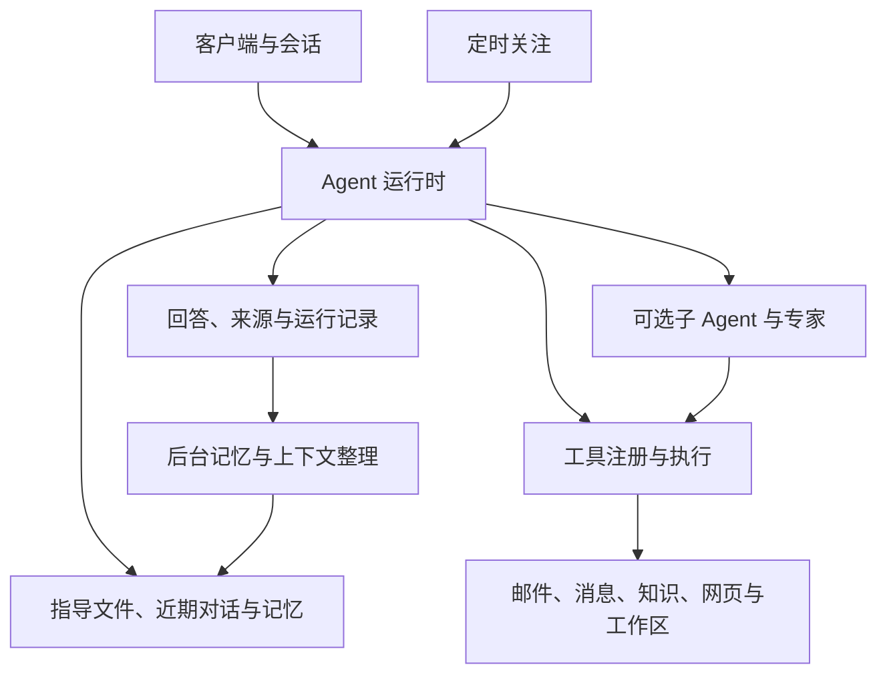

# 系统说明

本页说明当前后端组成及协作方式，不包含实施计划或测试过程记录。
具体请求、状态与控制接口以 [API 说明](api_contract.md) 为准。

## 各部分如何协作

客户端可以是命令行、独立桌面前端或自行接入的应用。
后端以 FastAPI 提供普通请求和 SSE 流，SQLite 保存会话、运行及各领域数据。
不同会话显式传递身份，没有隐式的全局“当前会话”。

## Agent 与工具

Agent 根据目标选择工具包，再按需展开具体工具，循环进行决策、执行和观察。
一个执行步骤调用一个工具或进入回答阶段；最终用户回答与内部控制动作分开生成。
工具输入、输出、只读声明和安全审查由执行器处理，领域服务不隐藏模型调用。
Agent 的每次工具调用都经过配置的逐调用审查，包括只读工具；`skip` 也会记录决定。工作区外
文件目标和 Bash 工作目录只获得当前调用的精确路径批准，子 Agent 的冻结路径范围仍是上限。
Bash 命令参数不受 OS 文件沙箱约束。

可选多 Agent 调度将独立子问题放进任务计划，冻结各自上下文、工具范围和预算。
子任务结果回到父任务后再进行合同及工具记录检查；失败可以反馈并修订计划。
邮件专家执行只读批处理，外部代码专家是单独启用的接入。

## 信息如何进入上下文

- 会话提供近期问答和已发布摘要，完整历史仍保存在本地。
- 指导文件按全局及项目路径加载，变更后重建索引和摘要。
- 长期记忆按全局或项目范围选择有效内容，派生记忆不修改用户指导文件。
- 知识检索、邮件、消息和网页提供选取的来源片段，而非整个数据源。
- 长工具结果保存为本地记录，模型先看到预览，再使用相应工具继续读取。

摘要、预览、搜索结果和阅读覆盖描述不同含义；进入模型输入不等于模型正确理解。
工具资料作为来源内容，不能替代用户要求或提升操作许可。
外部内容 gate 使用有界的中英文启发式检测常见指令式文本；扫描不完整会标记为未知，并保留
原始内容及来源信息。它不封禁来源或工具，也不保证识别所有恶意文本。

## 检索与缓存

本地知识支持 FTS 关键词和可选 FastEmbed / sqlite-vec 语义通道，
可通过多个查询并行召回后融合、统一重排序并选取结果。
消息使用实时本地关键词来源，现有消息并不自动参加向量召回。

普通工具缓存与网页快照分工不同：`observation` 回读当前运行的工具原始结果，
网页工具管理会话范围内的搜索记录和正文快照，支持跨轮续读、定位及显式刷新。
旧快照的时间和刷新失败都要保留，不能把本地回读当成新一次联网。

## 后台工作

记忆提取、上下文压缩和消息分析使用持久作业、租约、检查点与重试。
发布前复核来源许可、版本和水位，避免旧 worker 覆盖新结果。
前台与后台共享模型并发控制；消息分析与记忆／自动压缩独立计量。
记忆／自动压缩默认不设常规 token 配额，异常累计消耗触发持久化熔断，
阻止后续调用并取消同池在途请求。后台等待配额或熔断时不自动重置账本。

记忆入库前通过作用域内分页候选发现进行等价／更新判断；独立维护作业再整理
多条重复或互补记录。模型只提出方案，领域服务以同范围／类型／期限、来源、
多条版本 CAS 和作业租约原子提交，保留历史及撤销记录。去抖和周期扫描弥补
前台操作／提取与入队之间的空隙；处理中新增的版本不能被标成已完成。

定时关注将定义和每次执行分开保存，按照时区唤醒，为简报创建新会话。
任务只能读取已授权的数据源；暂停、取消和重新授权会影响后续执行。

## 源码组织

| 目录 | 职责 |
| --- | --- |
| `app/api/` | HTTP、SSE 与请求校验 |
| `app/core/` | Agent、模型连接、会话、上下文和通用执行控制 |
| `app/domains/` | 邮件、知识、消息、记忆、事项等确定性业务 |
| `app/tool_packages/` | Agent 可调用的工具及描述 |
| `app/integrations/` | 模型之外的外部服务接入 |
| `app/platform/` | Windows / Linux 路径、文件和进程适配 |
| `tests/`、`evals/` | 回归测试及可复用评测数据与程序 |
| `scripts/` | 启动、维护、评测和部署工具 |

仓库的 `AGENTS.md` 保留简短开发规则。当前工作区的工程资料单独管理，
不作为发布包的一部分，也不是客户端运行所必需。
