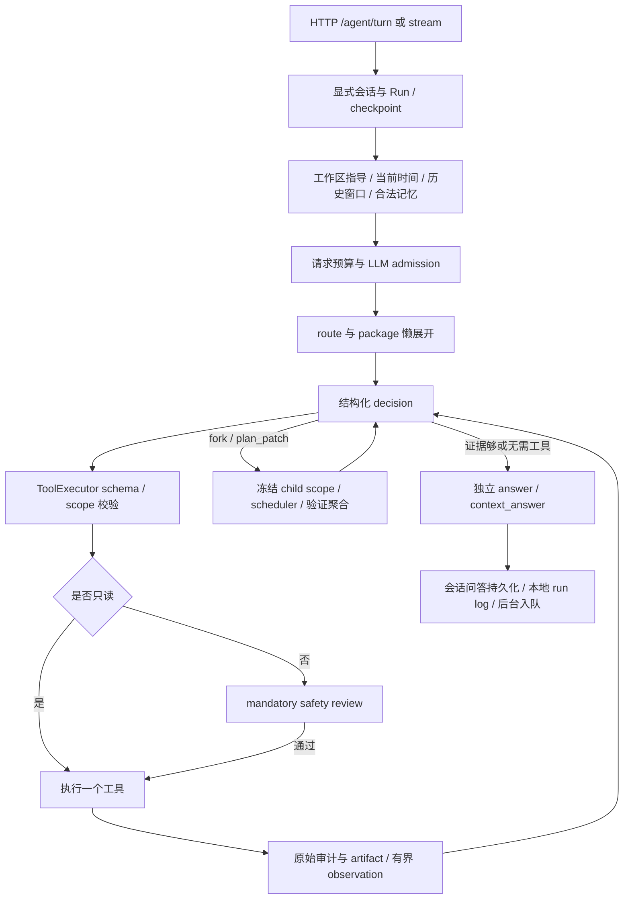

# 当前模块与运行流程

核对日期：2026-10-03。本页按当前代码整理入口、数据流和边界；HTTP 参数以
[API Contract](api_contract.md) 为准，开发队列以 [MVP Todolist](mvp_todolist.md)
为准。本轮检查结果见 [项目维护记录](project_maintenance_2026-10-03.md)。

## 模块地图

| 模块 | 主要实现 | 输入与结果 | 边界 |
| --- | --- | --- | --- |
| 应用与生命周期 | `app/api/main.py`、`app/core/runtime.py` | 配置、SQLite、服务/工具组装；启动/停止后台线程 | Runtime 负责依赖组装，不代替领域服务做决策 |
| 通用 Agent | `agent_turn.py`、`agent_graph.py`、`agent_tool_graph.py` | `/agent/turn`、SSE；package 展开、决策、观察、独立回答 | 一个步骤一个工具或结束动作；工具走 schema 校验与安全门 |
| 持久运行与安全 | `agent_runs.py`、`agent_storage.py`、`agent_checkpoints.py`、`safety.py` | run/event/checkpoint、取消、审批、恢复 | 完整日志留本地，普通 API 返回受限摘要；进程内执行 lease 不等于多进程锁 |
| 子任务与聚合 | `multi_agent*.py`、`child_agent.py`、`context_driver.py`、`agent_executors.py` | `fork_subtasks` / `plan_patch`、冻结 ContextSnapshot、TaskResult、验证 | Child ToolView 与预算由服务端确定；子任务声明成功仍须合同和实际工具审计通过 |
| LLM 与请求预算 | `core/llm/`、`prompt_tokens.py`、`prompt_budget.py`、`llm_workloads.py` | 请求/会话/配置选模型；stream/complete、错误分类、容量检查、用量 | 模型容量需配置；tokenizer 可选，未配时使用 UTF-8 字节保守估算；不下载 tokenizer |
| 会话与项目 | `sessions.py`、`domains/projects.py`、`api/routes/sessions.py`、`projects.py` | 多轮历史、分页/查询/回收站、workspace、稳定 project_id | 项目登记不建目录；显示名称 CAS 不搬目录；会话切换必须传 session_id |
| 本地知识 | `domains/knowledge*.py`、`workspace_knowledge.py`、`tool_packages/knowledge.py` | 文档/邮件镜像 → chunk/FTS → 可选本地向量/重排 → 有界证据 | 隐私过滤；检索内容是不可信数据；模型下载必须显式允许 |
| 邮件与事务 | `domains/mail.py`、`mail_knowledge.py`、`matters.py`、对应工具包、`integrations/outlook.py` | JSON 导入/Graph delta 同步；检索/清单/加载；独立事项 CRUD | MailService / MatterService 不调用 LLM；旧 mail_matters 为兼容数据 |
| 邮件专家 | `app/experts/mail.py`、`mail_organize.py`、`tool_packages/mail_expert_tools.py` | 可选 `mail_expert@1`；元数据快照、批量正文、分片分析、候选对齐 | 默认关闭；只读 ChildExecutor；不发信、不直接创建事项；明确报告部分覆盖 |
| 工具结果回读 | `tool_result_gate.py`、`tool_packages/observation.py` | 大结果本地 artifact → 预览/JSON Pointer 分页回读 | 只接受当前 run 的 artifact；跨 run/child 拒绝；完整原始结果仍可审计 |
| 运行指导 | `instruction_files.py`、`tool_packages/instructions.py` | 全局、项目路径链、关注 AGENTS.md；摘要、索引、预览、分页、SHA CAS 更新 | 摘要不保证含全部规则；指导不能扩大权限；更新经过非只读安全审查 |
| 记忆与侧写文件 | `domains/memory.py`、`memory_context.py`、`memory_extraction.py`、`memory_files.py` | 用户来源 → 候选/确认/冲突/撤回 → 全局/项目 recall、MEMORY.md | 长期记忆不授予工具权限；child 只收到明确分配的固定版本引用 |
| 后台作业 | `background_jobs.py`、`memory_background.py`、`background_llm.py`、`domains/memory_settings.py` | 抽取/压缩队列、租约、重试、取消、恢复、配置/健康/SSE | 发布需 lease epoch 与水位/CAS；控制 API 不返回 payload；系统配置重启生效 |
| 网页与关注 | `integrations/web_search.py`、`tool_packages/web.py`、`watch_scheduler.py`、`watch_execution.py`、`domains/watch*.py` | Brave 搜索、公开 HTTPS 文本；每日 occurrence → 新会话 → 只读 child → 简报 | 网页 DNS/IP/重定向校验；搜索配额；私有账户与外部搜索混用需显式授权 |
| 工作区文件与命令 | `platform/`（`commands.py`、`windows_process.py`、`processes.py`、`safe_files.py`）、`tool_packages/filesystem.py`、`bash.py`、`api/routes/session_files.py` | 路径/扫描、预览、SHA 文件编辑；Windows PowerShell/ConPTY/Job、POSIX bash/PTY | 预览以目录句柄链拒绝链接/reparse；bash 的 cwd 限制不是 OS sandbox，命令动态只读分类 |
| 前端偏好 | `api/routes/ui_preferences.py`、`agent_ui_preferences` 表 | 模型、stream、安全模式、workspace parent 的本机默认值 | 不改现有会话；前端偏好不能降低后端安全门 |

表中仅写文件名的 core 文件位于 `app/core/`。详细设计入口：
[多 Agent 文档](multi_agent_runtime_architecture.md)、
[邮件专家](mail_expert_design.md)、[记忆/后台](memory_background_implementation.md)、
[网页/关注](personal_assistant_web_and_watches.md)、[指导文件](agent_instruction_files.md)。

## 一次前台对话

`assistant_message` 用于过程展示，不执行工具，也不补成最终答案。最终回答 delta 来自
`display_target=assistant_answer`；最终事件用于校准。取消、审批等待、预算耗尽和异常
应成为可追踪状态，不能借坏 JSON 或缺失审计恢复成假成功。

## 邮件处理

1. 导入或同步先持久化账户、邮件、附件 metadata、chunk，并投影到通用 knowledge。
2. 普通 Agent 可用 `mail.search` 找相关证据；完整列举使用 `mail.list`，按带时区的
   `[received_from, received_before)` 区间、稳定名次与同一 listing token 续页。
3. `mail.list` 每页最多 20 张元数据卡片。候选集变化或进程重启拒绝旧 token；
   搜索的 `possible_more` 不代表精确总量，元数据覆盖也不代表正文分析覆盖。
4. 可选邮件专家以只读快照（最多 500 封）、批量正文加载和有界分片分析生成总结与候选。
   意图包含搜索、枚举、审阅、发件人分组和与现有事项对齐；实际工具仍走 ToolExecutor。
5. 写事务仍由通用 Agent 展开 `matter`，检查重复后创建/更新，并留下安全审查。
   不增加 `/mail/process`，不让领域服务隐藏 LLM 决策循环。

## 记忆学习与异步压缩

已持久化用户输入和问答 → 与 SQLite 事务配合登记抽取输入/压缩水位 → 后台作业领取
owner/lease epoch → 本地抽取或显式启用的模型抽取 / 有界摘要 → 来源、秘密/PII、学习开关、
项目范围、版本与租约复检 → 发布候选/确认记忆或 CAS 摘要 → 下一轮 recall。

普通偏好先成为候选，独立重复来源可晋升；冲突待审内容不注入上下文。原始消息与运行审计
保留，摘要属于有损派生视图。删除会话撤回相应来源，恢复会话不自动恢复派生记忆。
取消使旧租约失效并阻止旧 worker 发布，但不能撤销已完成结果或已发出的 HTTP 请求。
系统 memory/background 配置保存后重启生效；学习策略开关立即生效。

`MEMORY.md` 是带条目 ID/版本的生成侧写；手改检测、预览和单块导入使用版本校验，
不静默覆盖手改，也不把侧写文件当作用户 AGENTS.md。

## 每日关注

显式 watch 定义（目标、时区、每日时刻、来源/账户/工作区、混用许可） → 最近已到期日历槽
或 run-now → 唯一 occurrence 与租约 → 独立 session / parent run → 加载关注指导导航 →
服务端只读 Child ToolView 与预算 → 有界检索和证据 → importance/变化/不确定性归类 →
原子复检活动状态、scope version 与租约后发布简报。

每次发生都会有新会话，可继续追问。关注指导即使没有续读 offset，也可能因摘要遗漏规则而
需要 `instructions.search/read`。关注不能更新指导、发信、购买或改变外部状态。
简报当前可轮询，前端主动推送尚未实现；网页结果不等于已验证的票务状态。

## 当前支持边界

- 默认单机、单用户、单后端进程；不要将进程内 graph lease 当成多 worker 互斥。
- 新记忆/后台/项目接口有本机或 Bearer token 限制，文件预览有本机限制；
  历史 API 未统一应用同等鉴权。默认只绑定 `127.0.0.1`，CORS 不提供身份认证。
- 邮件专家、真实模型、Brave 和 Outlook 的本地测试替身验证不等于真实 provider 验收；
  模型质量评估和远程成本仍需要各自验证。Windows 原生实现与本轮验收状态见
  [平台支持](platform_support.md)及 [迁移清单](windows_native_todolist.md)；
  已有本地 NTFS 原生执行记录，UNC/SMB 和 macOS 未在本轮验收。真实 Codex 未安装/认证，
  stdio 协议与退出检查不代表真实 provider 验收。
- `watch_execution.py`、`watch_scheduler.py` 含领域编排与具体工具名，当前位于 core；
  与通用 core 的领域无关原则存在架构债。本轮记录边界，未做跨层迁移。
- Skill Evolution、通用历史运行检索、日历集成及 OS 级命令隔离仍未完成。
